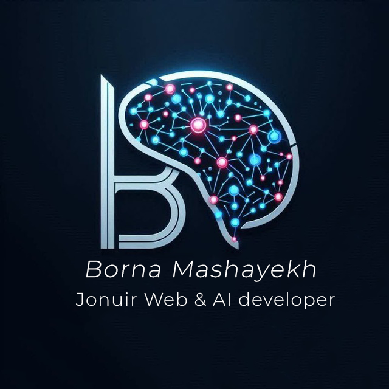

  
  <h1>💻 Borna Mashayekh</h1>
  <h3>Junior Full-Stack Developer | AI Enthusiast | UI/UX Designer</h3>
  
Transforming Ideas into Intelligent & Interactive Solutions

  <a href="https://bornmashayekh.ir" target="_blank">🌐 bornmashayekh.ir</a>

---

### 👨‍💻 About Me

🎯 Passionate about building intelligent, scalable and beautiful applications using web technologies and artificial intelligence.

💡 I can build:  
- ⚡ Responsive Websites  
- 📲 PWA & Mobile Apps (Ionic, Capacitor)  
- 🤖 AI-powered Tools  
- 🚀 SEO-optimized platforms  
- 🧠 Smart Systems using Python & ML  

🌱 Currently exploring advanced AI integrations with real-time web systems.

---

### 🌐 Connect With Me

 
 
 

---

### 🛠️ Tech Stack
#### 👨‍💻 Front-End

#### ⚙️ Back-End & Dev Tools

 

#### 🧠 AI/ML & Data

#### 🧰 Tools & DevOps

---

### 📈 GitHub Stats

  
  

  

---

  

<!-- ## 🏆 GitHub Trophies

-->
<!--  -->
